# Advanced OCR Techniques
This presentation comes from an enterprise solution, so the code cannot be presented here. Instead I'd like to outline the technique and approaches to building an Optical Character Recognition system from scratch. An Optical Character Recognition system in this case is taking patient medical information written on paper and converting it into a text json file.

## What is an OCR Service?
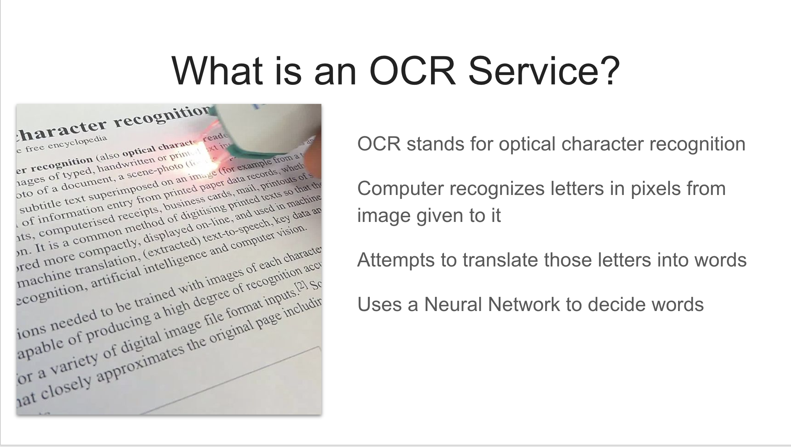
* OCR stands for optical character recognition.
* The computer recognizes letters in pixels from image given to it.
* A common example would be the pen hovering over the letters in the document in the image above to read them into memory.
* Through image analysis, OCR attempts to translate those letters into words.
* Some OCR services are more simplistic, but ours was going for accuracy.
* It looked like I was going to need a Neural Network for most of my heavy lifting.

## Neural Network
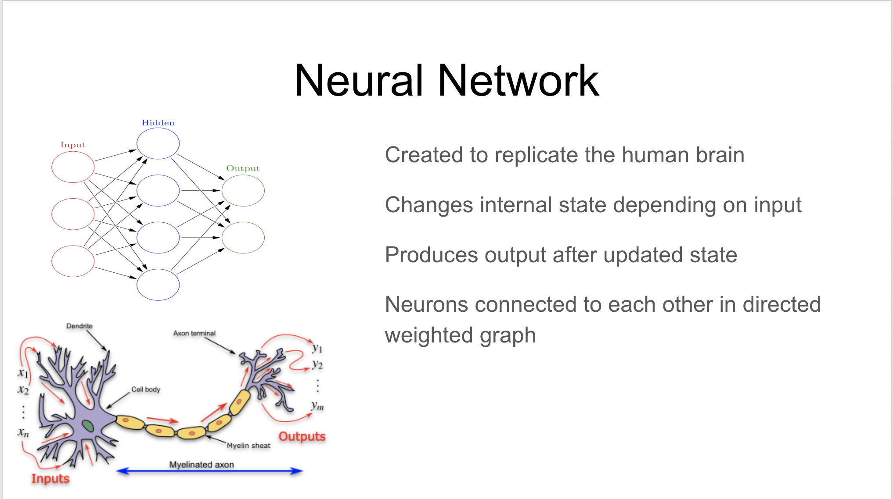
An artificial neural network was originally created to replicate the neurons in the human brain. It is made of a network of simple elements called artificial neurons, which receive input, change their internal state (activation) according to that input, and produce output depending on the input and activation. The network forms by connecting the output of certain neurons to the input of other neurons forming a directed, weighted graph. The weights as well as the functions that compute the activation can be modified by a process called learning which is governed by a learning rule. I know that sounds confusing, but it basically means that you can feed corrections into the network when it makes mistakes, and it slowly stops making those mistakes as often.

## Neural Network Visualized
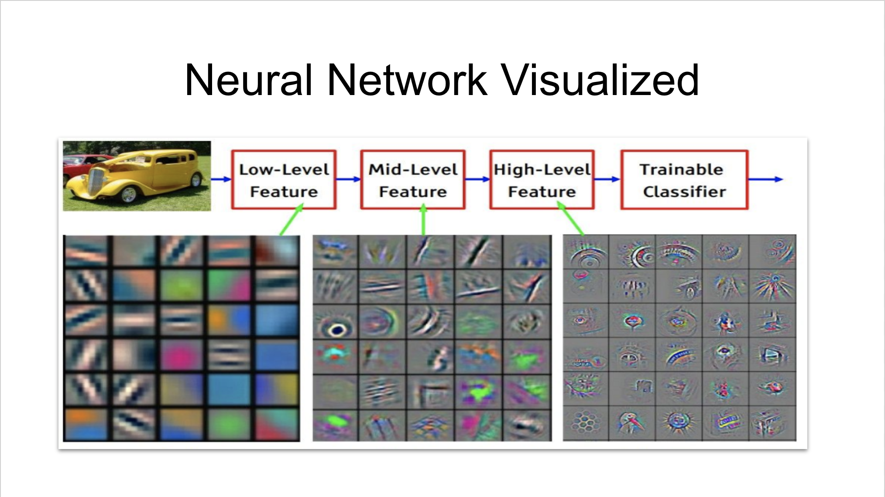
Much like the a human brain, neural networks filter their environment down until they arrive at a conclusion. Look at the image above. The neural network is using low-level, mid-level, and high-level features to determine that the image is of a car. Low-level features include simple structures such as lines and curves. Mid-level features contain spatial awareness and bags of features such as grass, snow, and sky. High level features contain objects that are easy to identify in the photo with the intent of determining the nature of the photo itself. For example if you knew that Santa Claus, elves, and a factory were in a photo, a pretty good guess would be to assume that the photo was of Santa’s workshop.

## Why Do I Care?
* I had a lot of charts!
* Some of them were well formatted and without any handwriting, but most of them weren't.
* I needed to use OCR to turn a physician's sometimes bad handwriting into something legible.
* The chart to the left is one of the poorer formatted charts. Notice how the contrast is poor in some places, with the document also leaning slightly to the left.
* This will inhibit the neural network’s ability to process the words in the document correctly and should be fixed to improve this document’s results.

## Baseline?
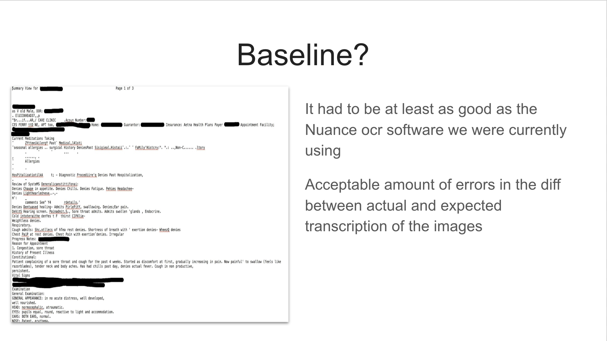
* What was the baseline for this new software?
* It had to be at least as good as the Nuance OCR software we were currently using.
* Acceptable amount of errors in the difference between actual and expected transcription of the images.
* The image to the left is the Nuance transcription of the image in the previous slide.
* This was going to be what I would have to beat.

## Steps to Find Solution
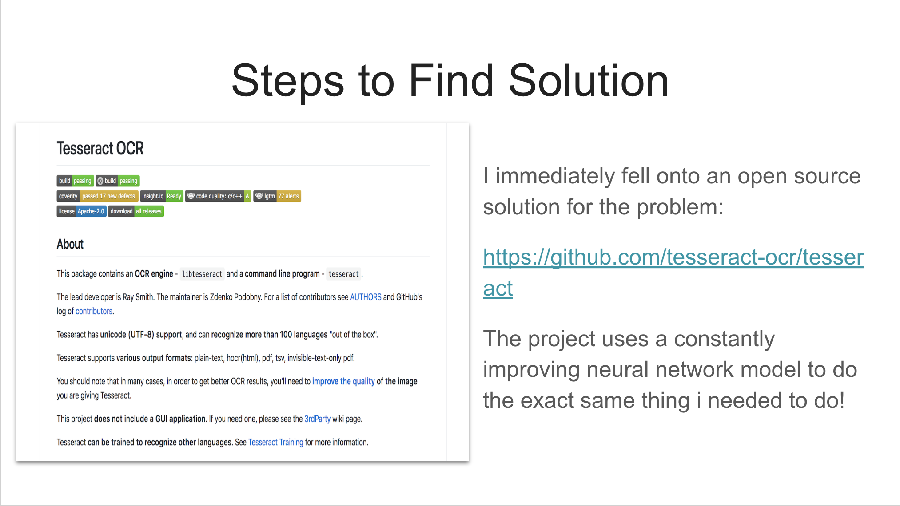
I immediately fell onto an open source solution for the problem:
https://github.com/tesseract-ocr/tesseract
The project uses a constantly improving neural network model to do the exact same thing i needed to do!

## Docker
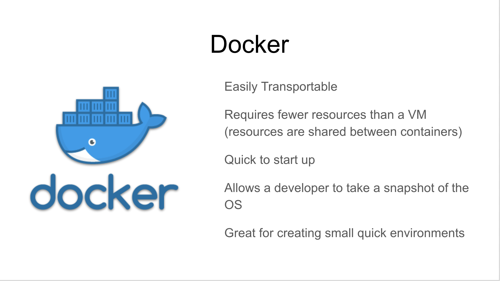
I knew that if I wanted to have this neural network easily transportable, I'd have to find a way to give it to our teams in India quickly, so docker was the next piece of software added to the list. If you are unfamiliar with docker think of it as a more transportable VPC (If you are unfamiliar with a VPC, think of it as a fake computer in a real computer). With this, i could automatically download the latest version of the tesseract along with any applicable libraries with a simple command

## Starting Out
Running the tesseract on the initial input documents I received for the project, produced results comparable to the Nuance solutions. The main difficulty was actually getting the real document's words transcribed into text so I could evaluate accuracy. It would have required going into the pdf document and transcribing all the words by hand before checking to see which solution was closest to the actual results. I was also having difficulty dealing with so many different types of documents. Since the images came from a wide variety of sources, image types, and fonts, my neural network couldn’t get the accuracy it needed to beat the Nuance benchmarks without a little help

## Playing Around with the Results
The first thing I tried was to play around with the pixel density of the incoming charts. I found through experimentation that different words would appear or disappear depending on the dpsi of the chart (like zooming in and out with binoculars).

Once I figured out that the words disappearing / reappearing were in different spots when the apertures were moved, I started taking snapshots from the three apertures with the best results. Whenever a word is disagreed upon by an aperture, it is compared to the same word in the other two apertures. The final result is a combination of taking the best guesses for words and checking the words through semantic analysis and dictionary checking

## Sample Comparisons Over Apertures
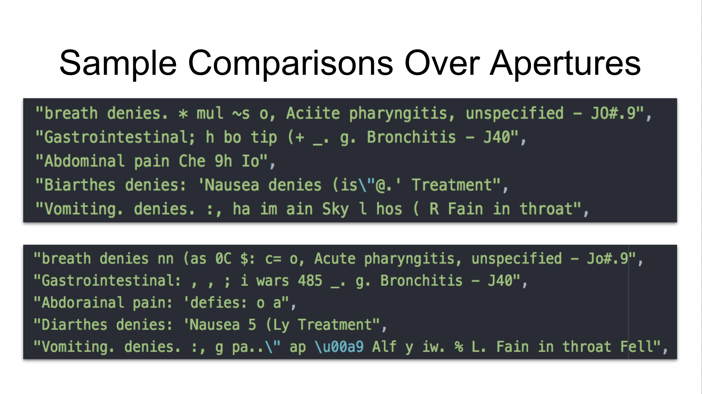

## Dictionary Checking
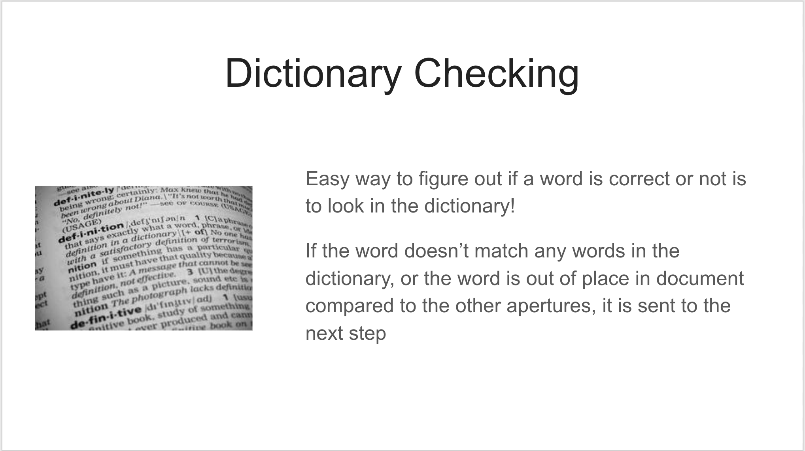
If a word isn’t in the dictionary, this is probably a sign that the OCR service transcribed the document in error. Multiple dictionary matches for the same word default to using the middle dpsi aperture.

## Semantic analysis
_“But what about proper nouns?” You might ask. “They aren’t in the dictionary. How do you know what to fix?”_
#### Great question. It can be answered in three parts
* All the diseases and medications the provider could be writing down are in apis through the CDC and FDA.
* Important information such as the provider’s / member’s name is going to be in the chart more than once. That means we can use the Levenshtein distance to look for words similar to our problem word. If it pops up with different spellings in the majority of the time we take the alternative form of the word.
* If I have a majority of the words spelled correctly, I can use semantic analysis to figure out which words should be proper nouns in the context of the sentence. I can use these words as words that are more likely to be the causes of error words later in the document.

## Results
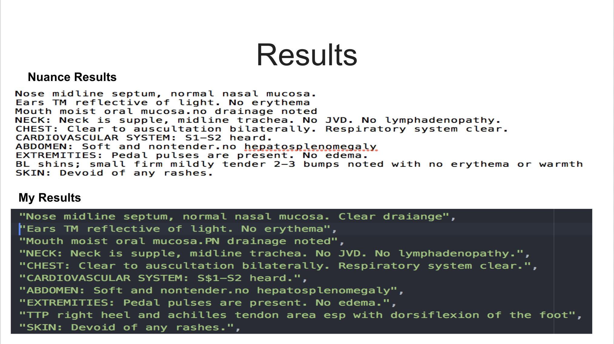
The improvement was very slight. Mostly in proper nouns and words in the dictionary that appeared enough times to get noticed by the Levenshtein distance calculations.

The project only lasted two weeks. I never got a chance to put anything into production as I had to move on to other tasks within the company. Hopefully some of what I did above inspires you to not be intimidated about taking on a challenge. I learn a good deal through the experience and would do it again in a second.

## Hypothetical Improvements
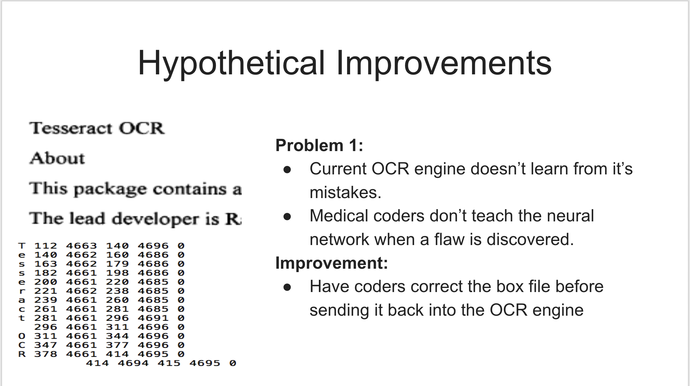
The main flaw of our current OCR engine is that it doesn't learn from it's mistakes. When a medical coder notices a flaw in the output from our current engine, they don't send the correction back into the neural network, they correct the mistake and send it to the next part of the process. If we had the coders correct the box file that comes out of the neural network before sending it back in again, the network would be able to learn from it's mistakes.

## Hypothetical Improvements
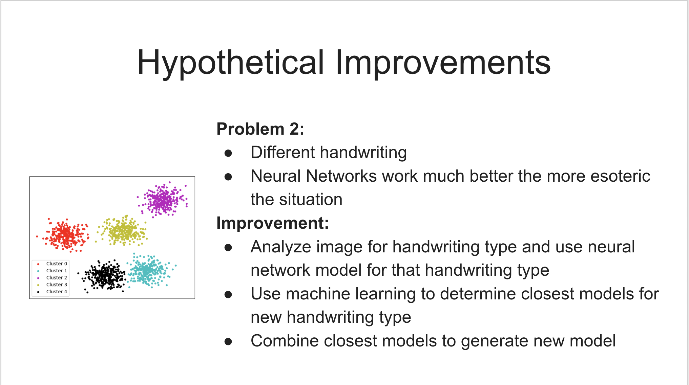
A second flaw with the process is that the handwriting from each of the providers is so different. This causes the neural network to overcompensate / undercompensate when different writing styles are fed into the engine (i.e. writing something in block print vs. cursive). A way to fix this discrepancy is to analyze the image to first to determine the type of handwriting involved to a significant margin. The software would then use the neural network model for that type of handwriting. If the type of handwriting involved is not determined to a significant margin, an analysis would be done to compare similarity to the other neural network models through clustering and dimension reduction. These outlying neural network models would combine weights based on similarity and be used to create another neural network to handle that type of handwriting.
